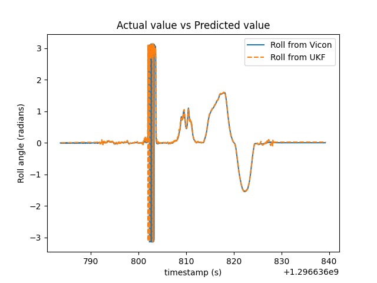
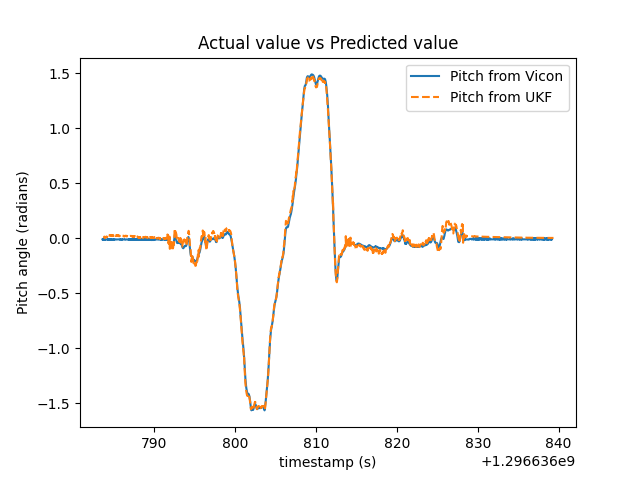
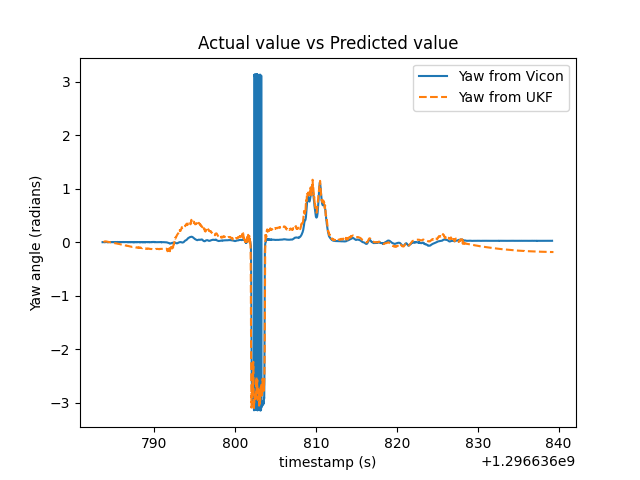
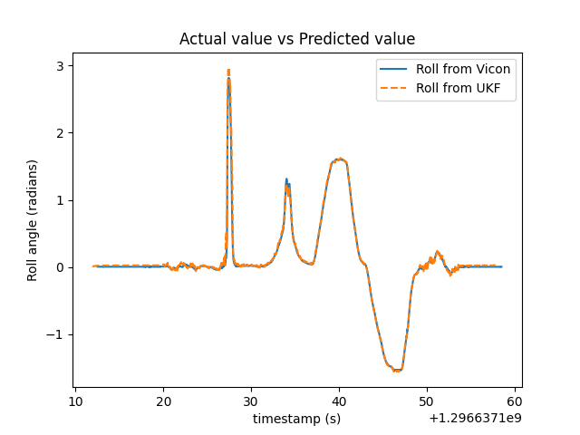
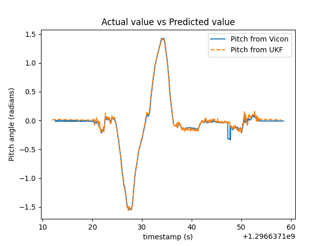
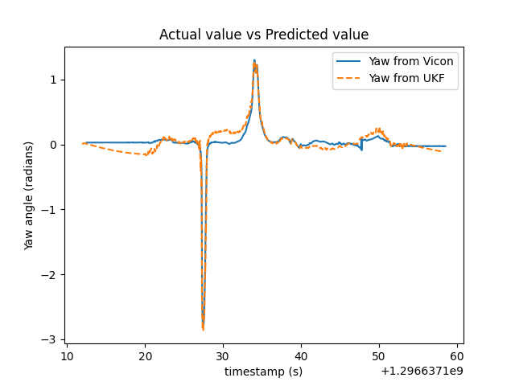
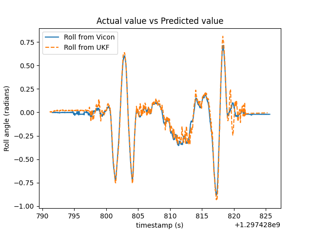
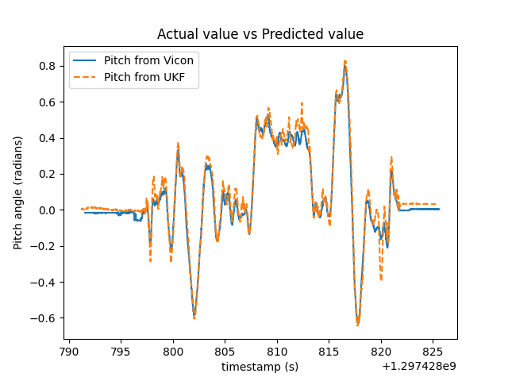
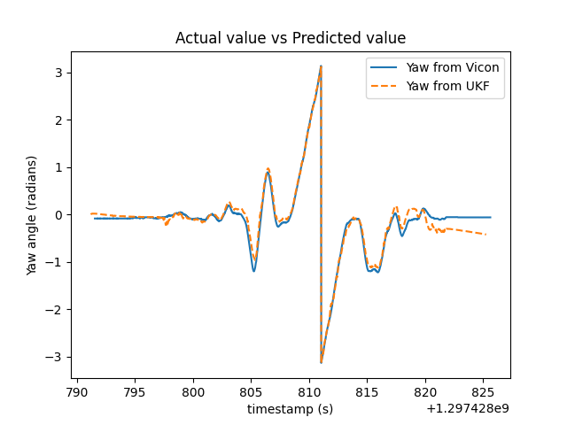

# Orientation Tracking using Unscented Kalman Filter
The ground truth of the orientation is captured by the vicon and is present in the `vicon` folder. The IMU datasets is present in the `imu` folder. estimate_rot.py tracks the orientation using the IMU data and UKF.

## Dataset 1
<table>
  <tr>
      <td align = "center">  </td>
      <td align = "center">  </td>
      <td align = "center">  </td>
  </tr>
  <tr>
      <td align = "center">Roll</td>
      <td align = "center">Pitch</td>
      <td align = "center">Yaw</td>
  </tr>
</table>

## Dataset 2
<table>
  <tr>
      <td align = "center">  </td>
      <td align = "center">  </td>
      <td align = "center">  </td>
  </tr>
  <tr>
      <td align = "center">Roll</td>
      <td align = "center">Pitch</td>
      <td align = "center">Yaw</td>
  </tr>
</table>

## Dataset 3
<table>
  <tr>
      <td align = "center">  </td>
      <td align = "center">  </td>
      <td align = "center">  </td>
  </tr>
  <tr>
      <td align = "center">Roll</td>
      <td align = "center">Pitch</td>
      <td align = "center">Yaw</td>
  </tr>
</table>

## Reference
> E. Kraft, "A quaternion-based unscented Kalman filter for orientation tracking," Sixth International Conference of Information Fusion, 2003. Proceedings of the, Cairns, Queensland, Australia, 2003, pp. 47-54, doi: 10.1109/ICIF.2003.177425.
